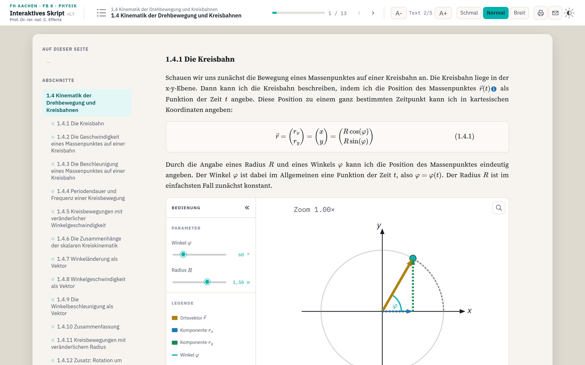

# Interaktives Physik-Skript — Drehbewegungen auf Kreisbahnen

[](https://github.com/ceffertzfhac/interaktives-skript/actions/workflows/pages.yml)

Ein Vorlesungsskript, das man **anfassen** kann: Statt statischer Abbildungen
stehen im Text interaktive Grafiken, in denen sich Winkel, Radius und Zeit
verstellen lassen und Vektoren, Bahnkurven und Diagramme sofort mitlaufen.
Entstanden für die Physik-Vorlesung im Fachbereich 8 der **FH Aachen**
(Prof. Dr. rer. nat. C. Effertz).

**→ [Skript öffnen](https://ceffertzfhac.github.io/interaktives-skript/)**



## Was drin ist

- **Kapitel 1.4 „Kinematik der Drehbewegung und Kreisbahnen"** mit den
  Abschnitten 1.4.1–1.4.12, Formeln in LaTeX-Satz (MathJax), Beispiel-,
  Bemerkungs- und Zusammenfassungs-Boxen.
- **Interaktive Aspekt-Figuren**: Kreisbahn und Ortsvektor (Abb. 1.38),
  Weg-Zeit-Diagramme *x(t)/y(t)* (Abb. 1.39) und das Winkel-Zeit-Diagramm
  *φ(t)* (Abb. 1.41) — mit Reglern, Ablaufsteuerung, Analyse-Werten und
  Vergleichskurven.
- **Lesekomfort**: Kapitelnavigation mit Seitenfortschritt, Inhaltsverzeichnis
  mit Suche, drei Spaltenbreiten, fünf Textgrößen, Dunkelmodus.
- **Druckansicht** mit QR-Codes, die vom Papier zurück zur jeweiligen
  interaktiven Grafik führen.

Das Skript wächst auf **15+ Kapitel**; der aktuelle Stand ist ein
Ausschnitt daraus. Geplantes und Offenes steht in [`BACKLOG.md`](BACKLOG.md).

## Lokal starten

Es gibt **nichts zu bauen** — kein Paketmanager, kein Bundler, kein Build-Schritt.
Ein beliebiger statischer Server genügt:

```bash
cd InteraktivesSkript_WIP
python3 -m http.server 8000
# http://localhost:8000/ öffnen
```

> **Wichtig:** Die Kapiteltexte werden zur Laufzeit per `fetch()` nachgeladen.
> Ein Doppelklick auf `index.html` (`file://`) zeigt deshalb nur das leere
> Grundgerüst — es braucht einen `http(s)`-Server. MathJax kommt von einem CDN,
> für den Formelsatz ist also eine Internetverbindung nötig.

## Aufbau des Repositorys

| Pfad | Inhalt |
|---|---|
| `InteraktivesSkript_WIP/` | **die Site** — hier finden alle Änderungen statt |
| `InteraktivesSkript_WIP/index.html` | Grundgerüst (Kopfleiste, Overlays, Kapitel-Platzhalter) |
| `InteraktivesSkript_WIP/chapters/` | ein HTML-Fragment je Kapitel, zur Laufzeit eingehängt |
| `InteraktivesSkript_WIP/src/` | ES-Module: `main.js` + Kern, Seiten, Shell, Druck, `figures/` |
| `InteraktivesSkript_WIP/bilder/` | statische Abbildungen (auch Druck-Fallback) |
| `Input/` | Quellmaterial, **nur lesend**: LaTeX-Skript v0.13, Stand-alone-Simulationen, eingefrorener Alt-Stand |
| `BACKLOG.md` | Roadmap und offene Punkte |
| `CLAUDE.md` | Architektur- und Konventionsübersicht für die Weiterentwicklung |

## Technik

Reines HTML/CSS/**Vanilla JavaScript** als native ES-Module, ohne Framework und
ohne Build-Schritt — bewusst so entschieden, damit das Skript ohne Toolchain
wartbar und langlebig bleibt. Alle Grafiken sind handgeschriebenes SVG/DOM.
Fremdcode: **MathJax v3** (Formelsatz, per CDN) und **qrjs2** (QR-Codes im
Druck, lokal unter `src/vendor/`).

Eine Figur oder ein Kapitel hinzuzufügen kostet bewusst nur **eine Datei plus
eine Zeile** — die Anleitungen dazu liegen im Repository:

- [`MIGRATION_v0.13_nach_HTML.md`](InteraktivesSkript_WIP/MIGRATION_v0.13_nach_HTML.md) — ein Kapitel aus dem LaTeX-Skript übernehmen
- [`INTERAKTIVE_ASPEKT_FIGUREN.md`](InteraktivesSkript_WIP/INTERAKTIVE_ASPEKT_FIGUREN.md) — eine interaktive Figur bauen
- [`VERIFIKATION_kapitel_1.4.md`](InteraktivesSkript_WIP/VERIFIKATION_kapitel_1.4.md) — Prüfplan für ein migriertes Kapitel

## Veröffentlichung

Der Workflow [`.github/workflows/pages.yml`](.github/workflows/pages.yml)
veröffentlicht `InteraktivesSkript_WIP/` bei jedem Push auf `main` als GitHub
Pages. Er lässt sich unter *Actions → GitHub Pages → Run workflow* auch manuell
aus einem anderen Branch auslösen.

## Mitwirken

Fehler und Verbesserungsvorschläge gern als
[Issue](https://github.com/ceffertzfhac/interaktives-skript/issues). Bei
Änderungen: kleine, thematisch getrennte Commits, deutsche Commit-Messages,
und vor größeren Umbauten ein Blick in `CLAUDE.md` und die Runbooks oben.

## Lizenz

Bislang nicht festgelegt. Ohne ausgewiesene Lizenz gilt das gesetzliche
Urheberrecht — eine Nachnutzung ist damit nicht gestattet. Für den Einsatz in
der Lehre bitte den Autor ansprechen.
